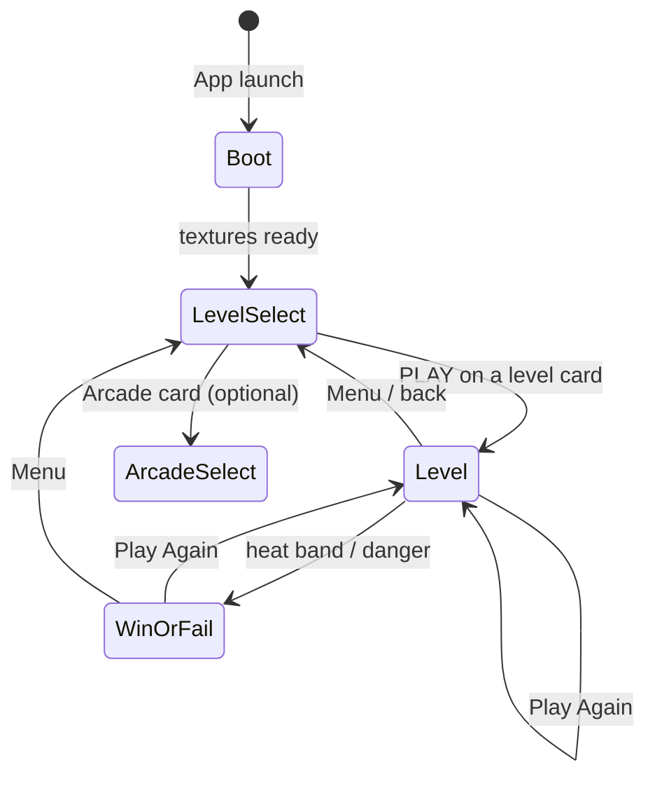

# Playtime — Science Festival Game

**Playtime** is an educational browser game that teaches biological signalling cascades through play. Players guide heat (or pollen) through tissue-like pathways to activate a target cell — invent the mechanic first, then learn the biology on the win/fail screen.

| Property | Value |
|----------|-------|
| **Production engine** | **Phaser 3 + TypeScript + Vite** ([`web/`](web/)) |
| Live URL | [Open the game](https://playtime.204.168.183.57.sslip.io/) |
| Levels (live) | Ice Age · Fire Meets Ice · The Allergy Cell · Two Keys |
| Design resolution | 1920 × 1080 (scales to device; phone-friendly level select) |
| Hosting | Hetzner VPS → `https://playtime.204.168.183.57.sslip.io/` |
| Prototype (archive) | Godot 4.5 / GDScript in repo root (`scripts/`, `scenes/`) |
| Branch | `develop_charlie` (do not push product work to `main` from this workflow) |

---

## Table of Contents

1. [Repository Layout](#1-repository-layout)
2. [Game State and Screen Flows](#2-game-state-and-screen-flows)
3. [Extended Level Breakdowns](#3-extended-level-breakdowns)
4. [Function Directory (Phaser / TypeScript)](#4-function-directory-phaser--typescript)
5. [Code Readability Rules](#5-code-readability-rules)
6. [Responsive Layout (Issue #1)](#6-responsive-layout-issue-1)
7. [Development Workflow](#7-development-workflow)
8. [Godot Prototype Archive](#8-godot-prototype-archive)

---

## 1. Repository Layout

```
Science-Festival-Game/
├── deploy.sh                     # DEFAULT: build web/ (Phaser) + upload to VPS
├── README.md                     # This file
├── web/                          # ★ PRODUCTION — Phaser 3 + TypeScript
│   ├── package.json              # phaser, vite, typescript
│   ├── vite.config.ts
│   ├── index.html                # Dev entry (#game mount)
│   ├── deploy.sh                 # Optional: deploy from web/ only
│   ├── dist/                     # Vite build output (committed from JLW sync)
│   ├── docs/                     # Web-side design notes
│   └── src/
│       ├── main.ts               # Phaser.Game bootstrap (Scale.RESIZE)
│       ├── types.ts              # LevelDef, palette, world constants
│       ├── sim/HeatField.ts      # 2D grid heat diffusion (no Phaser deps)
│       ├── input/GestureTracker.ts
│       ├── scenes/
│       │   ├── BootScene.ts
│       │   ├── LevelSelectScene.ts   # Responsive cards + ScrollPanel
│       │   └── LevelScene.ts
│       ├── ui/                   # Thermometer, hints, win/fail, ScrollPanel…
│       ├── visuals/              # Procedural art (no CDN assets)
│       ├── levels/*.json         # Level definitions
│       └── arcade/               # Optional festival mini-games hooks
│
├── project.godot                 # Godot prototype (archive)
├── scripts/                      # GDScript prototype sources
├── scenes/                       # Godot .tscn
├── assets/art/                   # Godot static art
├── resources/
├── docs/tech-spec-v1-norse-onboarding.md
└── scripts/{setup_godot,build}.sh
```

### Shell scripts

| Script | Purpose |
|--------|---------|
| [`deploy.sh`](deploy.sh) | **Default:** `npm` build of [`web/`](web/) → rsync `web/dist/` to VPS. Optional: `PLAYTIME_TARGET=godot` |
| [`web/deploy.sh`](web/deploy.sh) | Same Phaser path from inside `web/` |
| [`scripts/build.sh`](scripts/build.sh) | Godot-only local Web export to `build/` |
| [`scripts/setup_godot.sh`](scripts/setup_godot.sh) | One-time Godot 4.5.2 + templates (prototype only) |

---

## 2. Game State and Screen Flows

There is **no global score/lives store**. Phaser scenes own their state. Level data is declarative JSON under [`web/src/levels/`](web/src/levels/).



| Current | User action | Next | State notes |
|---------|-------------|------|-------------|
| Boot | automatic | Level select | Procedural textures built |
| Level select | PLAY on level | `LevelScene` with `levelId` | Layout rebuilds on resize/orientation |
| Level select | drag/wheel (phone/stack) | same screen | `ScrollPanel` scrolls fixed-height cards |
| Level | tap / swirl / drag / pinch | same | Updates `HeatField` + thermometer |
| Level | sustain in band | Win overlay (+ sneeze cutscene on Allergy Cell) | Sim frozen |
| Level | danger sustained (where configured) | Fail overlay | e.g. anaphylaxis on Allergy Cell |
| Win/Fail | Menu | Level select | Scene restart |

---

## 3. Extended Level Breakdowns

Defined in JSON; registered in [`web/src/levels/index.ts`](web/src/levels/index.ts).

### 1 — Ice Age (`ice_age.json`)

| Property | Detail |
|----------|--------|
| Theme | Frozen wasteland; thaw Scrat |
| Gestures | Tap fire, swirl to stoke, drag heat to creature |
| Win | Hold thermometer band (~45–70) for 2.5s → **THAWED!** |
| Biology line | Activating a cell / waking the immune system |

### 2 — Fire Meets Ice (`norse.json`)

| Property | Detail |
|----------|--------|
| Theme | Norse cavern; pathway around boulders |
| Obstacles | Boulder circles block heat diffusion |
| Win | Band 50–70 for 2.5s → **AWAKENED** |
| Biology | Pathway specificity metaphor |

### 3 — The Allergy Cell (`mast_cell.json`)

| Property | Detail |
|----------|--------|
| Theme | Nasal journey; pollen → mast cell |
| World | 3840px wide, camera follows |
| Fire kind | `pollen` |
| Win | Band 50–70 for 3.5s → sneeze cutscene → **AAACHOO!** |
| Fail | Sustained overshoot → **ANAPHYLAXIS** overlay |
| Biology | IgE / histamine / allergic reaction |

### 4 — Two Keys (`two_keys.json`)

| Property | Detail |
|----------|--------|
| Theme | Tissue; two pollen sources (`fire` + `fireSecondary`) |
| Mechanic | Dual-source heat with `keyHeatCap` |
| Creature | Mast-cell style target |

### Shared gameplay model

A source injects heat into a **2D grid** ([`HeatField`](web/src/sim/HeatField.ts)); heat diffuses with dissipation; obstacles block flow. The thermometer tracks a **manual heat** value (tap + proximity drag, decaying). Win = hold inside the golden band. Overshoot can trigger fail where configured. Biology is named on overlays, not during play.

---

## 4. Function Directory (Phaser / TypeScript)

Alphabetical by path. Public / notable methods only.

### `web/src/main.ts`

| Symbol | Description |
|--------|-------------|
| Phaser `Game` config | `Scale.RESIZE`, parent `#game`, scenes: Boot → LevelSelect → Level (+ arcade) |
| `__PHASER_GAME` | Optional `window` hook for headless verification |

### `web/src/types.ts`

| Symbol | Description |
|--------|-------------|
| `LevelDef` | Level JSON schema (palette, fire, creature, sim, win, fail, obstacles…) |
| `WORLD_WIDTH` / `WORLD_HEIGHT` | 1920 × 1080 design world |
| `GRID_W` / `GRID_H` / `CELL_SIZE` | Heat grid sizing |
| `obstaclesOf(def)` | Normalises obstacle list from a level def |

### `web/src/levels/index.ts`

| Symbol | Description |
|--------|-------------|
| `LEVELS` | Sorted unlocked level registry |
| `getLevel(id)` | Lookup by id |

### `web/src/sim/HeatField.ts` — class `HeatField`

| Method | Description |
|--------|-------------|
| `constructor(gridW, gridH, cellSize)` | Allocates heat / obstacle buffers |
| `setObstacleCircle(cx, cy, radius)` | Marks blocked cells |
| `worldToGrid(x, y)` | World → cell indices |
| `injectHeat(x, y, amount, radiusCells?)` | Local heat injection |
| `getHeatAt` / `getTargetHeat` | Sampling helpers |
| `update(dt)` | Accumulates and runs diffusion ticks |
| `tick()` (private) | One diffusion + dissipation step |

### `web/src/input/GestureTracker.ts` — class `GestureTracker`

| Method | Description |
|--------|-------------|
| `constructor(scene, callbacks, toWorld)` | Wires pointer events |
| `setSwirlPivot` / `setSecondarySwirlPivot` | Swirl centres (dual-fire levels) |
| Callbacks | `onTap`, `onDragStart/Move/End`, `onSwirlRevolution`, `onPinch` |

### `web/src/scenes/BootScene.ts`

| Method | Description |
|--------|-------------|
| `create()` | `buildProceduralTextures` then start level-select |

### `web/src/scenes/LevelSelectScene.ts` — class `LevelSelectScene`

| Method | Description |
|--------|-------------|
| `create()` / `shutdown()` | Resize + orientation listeners |
| `scheduleRebuild()` / `rebuildLayout()` | Debounced full UI rebuild |
| `createScrollParent(L)` | Attaches `ScrollPanel` when cards overflow |
| `makeCard` / `makeArcadeCard` / `makePlayButton` | Card UI |
| `launch(lvl)` | Starts `LevelScene` with `levelId` |

**Layout modes:** `desktop-row` · `desktop-stack` (scrollable) · `phone-scroll` (fixed card height + `ScrollPanel`).

### `web/src/scenes/LevelScene.ts` — class `LevelScene`

| Method | Description |
|--------|-------------|
| `init` / `create` / `update` | Level lifecycle |
| `handleResize` / `applyCameraTransform` | Fit world to viewport; camera-follow for wide levels |
| `handleTap` / `handleDrag*` / `handleSwirlRevolution` / `handlePinch` | Gesture → heat |
| `checkOutcomes` / `handleWin` / `handleAnaphylaxis` | Win/fail |
| `layoutThermometer` | Edge-anchored HUD |

### `web/src/ui/ScrollPanel.ts` — class `ScrollPanel`

| Method | Description |
|--------|-------------|
| `setViewport` / `setContentHeight` / `add` | Mask-free scroll region |
| Pointer + wheel handlers | Drag/wheel scroll; cull off-screen cards |
| Note | **No geometry masks** (iOS Safari white-screen bug) |

### `web/src/ui/Thermometer.ts` · `HintSystem.ts` · `WinOverlay.ts` · `FailOverlay.ts` · `SneezeCutscene.ts` · `DebugOverlay.ts` · `resultLayout.ts`

| File | Role |
|------|------|
| `Thermometer` | Band + danger + mercury; `setBounds` / `setHeat` / `update` |
| `HintSystem` | Timed progressive hints; `resize` for narrow screens |
| `WinOverlay` / `FailOverlay` | Result panels via `computeResultLayout` |
| `SneezeCutscene` | Allergy Cell win flourish |
| `DebugOverlay` | F3 grid/telemetry |
| `computeResultLayout` | Responsive overlay metrics |

### `web/src/visuals/*`

| File | Exports |
|------|---------|
| `textures.ts` | `buildProceduralTextures` |
| `palette.ts` | `sampleHeat`, `hexToInt`, colour constants |
| `backgrounds.ts` | `buildBackground` |
| `creature.ts` | `buildCreature` |
| `fire.ts` | `FireVisual` |
| `heatOverlay.ts` | `HeatOverlay` |
| `cardPreview.ts` | `drawCardMotif`, `lerpHex` |
| `interior.ts` | `buildInterior` (nasal journey décor) |

### `web/src/arcade/*`

Optional festival arcade card + `DropCatchScene`; registered in `arcade/registry.ts`.

---

## 5. Code Readability Rules

### Phaser / TypeScript (`web/`)

- Prefer descriptive names (`scrollOffset`, `cameraFollow`, `sourceHeatScale`).
- Keep simulation (`HeatField`) free of Phaser imports.
- Level content lives in JSON; code reads `LevelDef`.
- Comment non-obvious gesture / biology mapping at call sites.

### Godot prototype (`scripts/*.gd`)

Historical rules still apply in the archive: spelled-out identifiers and a comment above non-trivial lines. Prefer **not** extending Godot for new live features — extend [`web/`](web/) instead.

---

## 6. Responsive Layout (Issue #1)

### Status: **resolved on the live Phaser build**

GitHub Issue #1 (*Game Interface is Not Responsive to Screen Sizes*) is addressed in production by the Phaser level select, not by shipping the Godot export.

| Fix | Where |
|-----|--------|
| Fixed-height cards on phones | `LevelSelectScene` (`phone-scroll`, card height 132px) |
| Vertical list in portrait **and** short landscape | `min(w,h) < 520` → phone mode |
| Scroll when cards overflow | [`ScrollPanel`](web/src/ui/ScrollPanel.ts) — drag + wheel, viewport culling |
| Orientation changes | Debounced `rebuildLayout` + `orientationchange` |
| iOS white screen | **No Phaser geometry masks** (masks rendered as solid white on Safari) |

### Godot responsive helpers (kept as archive)

[`scripts/core/responsive_layout.gd`](scripts/core/responsive_layout.gd) and related menu/HUD GDScript changes remain on `develop_charlie` for the **prototype only**. They are **not** what players hit at the live URL. Prefer Phaser when closing Issue #1 against production.

### How to test (browser)

1. `cd web && npm install && npm run build` (or `./deploy.sh`).
2. Open [the live game](https://playtime.204.168.183.57.sslip.io/) (hard-refresh with `?v=` after deploy).
3. DevTools device mode:

| Profile | Expect |
|---------|--------|
| iPhone SE portrait | All level cards visible/stacked; swipe if needed |
| iPhone landscape | Scrollable list; no stretched/clipped-only cards |
| ~1280px laptop | Row or stack without overflow |
| Rotate emulator | Layout rebuilds without blank/white panel |

---

## 7. Development Workflow

### Production (Phaser) — preferred

```bash
cd /home/cle1g21/Science-Festival-Game/web
npm install
npm run dev          # http://localhost:5173
npm run build        # → web/dist/

# From repo root: build + deploy to VPS (default target is Phaser)
cd /home/cle1g21/Science-Festival-Game
./deploy.sh
```

Requires SSH to `root@204.168.183.57` **or** jump host `juri@51.77.146.49`.

**Live:** [https://playtime.204.168.183.57.sslip.io/](https://playtime.204.168.183.57.sslip.io/)

### Godot prototype (optional)

```bash
./scripts/setup_godot.sh   # once
./scripts/build.sh         # → build/
PLAYTIME_TARGET=godot ./deploy.sh   # only if you intentionally want the prototype live
```

---

## 8. Godot Prototype Archive

The repo root Godot 4.5 project is the **earlier prototype** (Norse onboarding with zone/channel heat, locked Ice Age card in GDScript menus). It is useful for history and IridisX headless exports, but **live festival play uses Phaser**.

| Area | Path |
|------|------|
| Project | [`project.godot`](project.godot) |
| Scripts | [`scripts/`](scripts/) (`main.gd`, `norse_onboarding.gd`, `heat_simulation.gd`, …) |
| Scenes | [`scenes/`](scenes/) |
| Spec | [`docs/tech-spec-v1-norse-onboarding.md`](docs/tech-spec-v1-norse-onboarding.md) |

Signal flow (prototype): Start Menu → Level Select → Narrative → Norse only. Heat model is discrete zones/channels (`Zone`, `Channel`, `HeatSimulation`, `WinDetector`), not the Phaser grid `HeatField`.

---

## License and Credits

Built for the University of Southampton Science Festival.  
Production runtime: [Phaser](https://phaser.io/) (MIT). Prototype engine: [Godot](https://godotengine.org/) (MIT).
