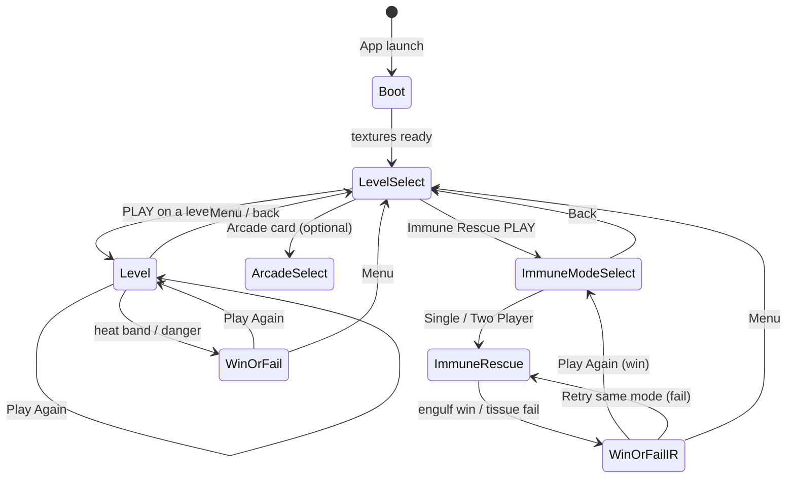

# Playtime — Science Festival Game

**Playtime** is an educational browser game that teaches biological signalling cascades through play. Players guide heat (or pollen) through tissue-like pathways to activate a target cell — invent the mechanic first, then learn the biology on the win/fail screen.

| Property | Value |
|----------|-------|
| **Production engine** | **Phaser 3 + TypeScript + Vite** ([`web/`](web/)) |
| Live URL | [Open the game](https://playtime.204.168.183.57.sslip.io/) |
| Levels (live) | Ice Age · Fire Meets Ice · The Allergy Cell · Two Keys · **Immune Rescue** (scene module) |
| Design resolution | 1920 × 1080 (scales to device; phone-friendly level select) |
| Hosting | Hetzner VPS → `https://playtime.204.168.183.57.sslip.io/` |
| Prototype (archive) | Godot 4.5 / GDScript in repo root (`scripts/`, `scenes/`) |
| Branch | `develop_charlie` (do not push product work to `main` from this workflow) |

---

## Table of Contents

1. [Repository Layout](#1-repository-layout)
2. [Game State and Screen Flows](#2-game-state-and-screen-flows)
3. [Extended Level Breakdowns](#3-extended-level-breakdowns)
4. [Function Directory (Phaser / TypeScript)](#4-function-directory-phaser--typescript)
4b. [Immune Rescue Function Glossary](#4b-immune-rescue-function-glossary-line-by-line)
5. [Code Readability Rules](#5-code-readability-rules)
6. [Responsive Layout (Issue #1)](#6-responsive-layout-issue-1)
7. [Development Workflow](#7-development-workflow)
8. [Godot Prototype Archive](#8-godot-prototype-archive)

---

## 1. Repository Layout

```
Science-Festival-Game/
├── deploy.sh                     # DEFAULT: build web/ (Phaser) + upload to VPS
├── README.md                     # This file
├── images/                       # Immune Rescue art (Tissue, bacteria, neutrophil)
├── web/                          # ★ PRODUCTION — Phaser 3 + TypeScript
│   ├── package.json              # phaser, vite, typescript
│   ├── vite.config.ts
│   ├── index.html                # Dev entry (#game mount)
│   ├── public/images/            # Symlink → ../../images (served to Phaser)
│   ├── deploy.sh                 # Optional: deploy from web/ only
│   ├── dist/                     # Vite build output (committed from JLW sync)
│   ├── docs/                     # Web-side design notes
│   └── src/
│       ├── main.ts               # Phaser.Game bootstrap (Scale.RESIZE)
│       ├── types.ts              # LevelDef, palette, world constants
│       ├── sim/HeatField.ts      # 2D grid heat diffusion (no Phaser deps)
│       ├── input/GestureTracker.ts
│       ├── scenes/
│       │   ├── BootScene.ts
│       │   ├── LevelSelectScene.ts   # Responsive cards + ScrollPanel (+ Immune Rescue card)
│       │   └── LevelScene.ts
│       ├── immune_rescue/        # ★ Dedicated Immune Rescue scene family (not LevelDef JSON)
│       │   ├── types.ts
│       │   ├── config.ts
│       │   ├── ChemotaxisField.ts
│       │   ├── NeutrophilController.ts
│       │   ├── BacterialSystem.ts
│       │   ├── TissueHud.ts
│       │   ├── ImmuneAssistant.ts    # Optional non-autonomous AI coach
│       │   ├── ImmuneModeSelectScene.ts
│       │   └── ImmuneRescueScene.ts
│       ├── ui/                   # Thermometer, hints, win/fail, ScrollPanel…
│       ├── visuals/              # Procedural art (no CDN assets)
│       ├── levels/*.json         # Level definitions
│       └── arcade/               # Optional festival mini-games hooks
│
├── project.godot                 # Godot prototype (archive)
├── scripts/                      # GDScript prototype sources
├── scenes/                       # Godot .tscn
├── assets/art/                   # Godot static art
├── resources/
├── docs/tech-spec-v1-norse-onboarding.md
└── scripts/{setup_godot,build}.sh
```

### Shell scripts

| Script | Purpose |
|--------|---------|
| [`deploy.sh`](deploy.sh) | **Default:** `npm` build of [`web/`](web/) → rsync `web/dist/` to VPS. Optional: `PLAYTIME_TARGET=godot` |
| [`web/deploy.sh`](web/deploy.sh) | Same Phaser path from inside `web/` |
| [`scripts/build.sh`](scripts/build.sh) | Godot-only local Web export to `build/` |
| [`scripts/setup_godot.sh`](scripts/setup_godot.sh) | One-time Godot 4.5.2 + templates (prototype only) |

---

## 2. Game State and Screen Flows

There is **no global score/lives store**. Phaser scenes own their state. Level data is declarative JSON under [`web/src/levels/`](web/src/levels/).



| Current | User action | Next | State notes |
|---------|-------------|------|-------------|
| Boot | automatic | Level select | Procedural textures built |
| Level select | PLAY on level | `LevelScene` with `levelId` | Layout rebuilds on resize/orientation |
| Level select | PLAY on **Immune Rescue** | `immune-mode-select` | Dedicated scene module (not JSON) |
| Level select | drag/wheel (phone/stack) | same screen | `ScrollPanel` scrolls fixed-height cards |
| Immune mode select | Single / Two Player | `immune-rescue` + `{ mode }` | Tissue backdrop + large buttons |
| Immune Rescue | joystick / P2 taps | same | Chemotaxis field + tissue HUD |
| Immune Rescue | engulf N colonies | Win overlay | Biology: chemotaxis / phagocytosis |
| Immune Rescue | tissue integrity ≤ 0 | Fail overlay | Biology: uncontrolled infection |
| Level | tap / swirl / drag / pinch | same | Updates `HeatField` + thermometer |
| Level | sustain in band | Win overlay (+ sneeze cutscene on Allergy Cell) | Sim frozen |
| Level | danger sustained (where configured) | Fail overlay | e.g. anaphylaxis on Allergy Cell |
| Win/Fail | Menu | Level select | Scene restart |

---

## 3. Extended Level Breakdowns

Defined in JSON; registered in [`web/src/levels/index.ts`](web/src/levels/index.ts).

### 1 — Ice Age (`ice_age.json`)

| Property | Detail |
|----------|--------|
| Theme | Frozen wasteland; thaw Scrat |
| Gestures | Tap fire, swirl to stoke, drag heat to creature |
| Win | Hold thermometer band (~45–70) for 2.5s → **THAWED!** |
| Biology line | Activating a cell / waking the immune system |

### 2 — Fire Meets Ice (`norse.json`)

| Property | Detail |
|----------|--------|
| Theme | Norse cavern; pathway around boulders |
| Obstacles | Boulder circles block heat diffusion |
| Win | Band 50–70 for 2.5s → **AWAKENED** |
| Biology | Pathway specificity metaphor |

### 3 — The Allergy Cell (`mast_cell.json`)

| Property | Detail |
|----------|--------|
| Theme | Nasal journey; pollen → mast cell |
| World | 3840px wide, camera follows |
| Fire kind | `pollen` |
| Win | Band 50–70 for 3.5s → sneeze cutscene → **AAACHOO!** |
| Fail | Sustained overshoot → **ANAPHYLAXIS** overlay |
| Biology | IgE / histamine / allergic reaction |

### 4 — Two Keys (`two_keys.json`)

| Property | Detail |
|----------|--------|
| Theme | Tissue; two pollen sources (`fire` + `fireSecondary`) |
| Mechanic | Dual-source heat with `keyHeatCap` |
| Creature | Mast-cell style target |

### Shared gameplay model

A source injects heat into a **2D grid** ([`HeatField`](web/src/sim/HeatField.ts)); heat diffuses with dissipation; obstacles block flow. The thermometer tracks a **manual heat** value (tap + proximity drag, decaying). Win = hold inside the golden band. Overshoot can trigger fail where configured. Biology is named on overlays, not during play.

### 5 — Immune Rescue (dedicated scene module)

**Not** a [`LevelDef`](web/src/types.ts) JSON level. Entry is a home-screen card peer to Arcade; gameplay lives under [`web/src/immune_rescue/`](web/src/immune_rescue/).

| Property | Detail |
|----------|--------|
| Theme | Tissue micro-environment; steer a **neutrophil** |
| Entry | Level select → **Immune Rescue** → mode select |
| Modes | **Single:** AI spawn + replication. **Two-player (same screen):** P1 left half steers; P2 right half taps colonies / holds decoys |
| Simulation | [`ChemotaxisField`](web/src/immune_rescue/ChemotaxisField.ts) wraps `HeatField`; teal chemokine overlay |
| Controls | Virtual joystick (bottom-left / left zone) + soft chemotaxis assist; drag near neutrophil also grabs stick |
| Win | Engulf **8** colonies before tissue integrity hits 0 |
| Fail | Tissue integrity ≤ 0 (infection pressure from live colonies) |
| Biology | Chemotaxis (follow chemical trail) + phagocytosis (engulf) on win; uncontrolled infection on fail |
| Optional AI | Toggle **AI route** — highlights a short visit order through all live colonies from your position (does not steer) |

**Flow:** `level-select` → `immune-mode-select` → `immune-rescue` → `WinOverlay` / `FailOverlay` → Menu (level select) or Play Again (mode select on win; same mode retry on fail).

---

## 4. Function Directory (Phaser / TypeScript)

Alphabetical by path. Public / notable methods only.

### `web/src/main.ts`

| Symbol | Description |
|--------|-------------|
| Phaser `Game` config | `Scale.RESIZE`, parent `#game`, scenes: Boot → LevelSelect → Level (+ arcade + Immune mode select + Immune Rescue) |
| `__PHASER_GAME` | Optional `window` hook for headless verification |

### `web/src/types.ts`

| Symbol | Description |
|--------|-------------|
| `LevelDef` | Level JSON schema (palette, fire, creature, sim, win, fail, obstacles…) |
| `WORLD_WIDTH` / `WORLD_HEIGHT` | 1920 × 1080 design world |
| `GRID_W` / `GRID_H` / `CELL_SIZE` | Heat grid sizing |
| `obstaclesOf(def)` | Normalises obstacle list from a level def |

### `web/src/levels/index.ts`

| Symbol | Description |
|--------|-------------|
| `LEVELS` | Sorted unlocked level registry |
| `getLevel(id)` | Lookup by id |

### `web/src/sim/HeatField.ts` — class `HeatField`

| Method | Description |
|--------|-------------|
| `constructor(gridW, gridH, cellSize)` | Allocates heat / obstacle buffers |
| `setObstacleCircle(cx, cy, radius)` | Marks blocked cells |
| `worldToGrid(x, y)` | World → cell indices |
| `injectHeat(x, y, amount, radiusCells?)` | Local heat injection |
| `getHeatAt` / `getTargetHeat` | Sampling helpers |
| `update(dt)` | Accumulates and runs diffusion ticks |
| `tick()` (private) | One diffusion + dissipation step |

### `web/src/input/GestureTracker.ts` — class `GestureTracker`

| Method | Description |
|--------|-------------|
| `constructor(scene, callbacks, toWorld)` | Wires pointer events |
| `setSwirlPivot` / `setSecondarySwirlPivot` | Swirl centres (dual-fire levels) |
| Callbacks | `onTap`, `onDragStart/Move/End`, `onSwirlRevolution`, `onPinch` |

### `web/src/scenes/BootScene.ts`

| Method | Description |
|--------|-------------|
| `create()` | `buildProceduralTextures` then start level-select |

### `web/src/scenes/LevelSelectScene.ts` — class `LevelSelectScene`

| Method | Description |
|--------|-------------|
| `create()` / `shutdown()` | Resize + orientation listeners |
| `scheduleRebuild()` / `rebuildLayout()` | Debounced full UI rebuild |
| `createScrollParent(L)` | Attaches `ScrollPanel` when cards overflow |
| `makeCard` / `makeArcadeCard` / `makeImmuneRescueCard` / `makePlayButton` | Card UI |
| `launch(lvl)` | Starts `LevelScene` with `levelId` |

**Layout modes:** `desktop-row` · `desktop-stack` (scrollable) · `phone-scroll` (fixed card height + `ScrollPanel`). Card count is `LEVELS.length + 2` (Immune Rescue + Arcade).

#### `makeImmuneRescueCard(cx, cy, w, h, compact, wholeCardClickable)` — new

- **Purpose:** Build the teal home card that opens Immune Rescue mode select.
- **Parameters:** Card centre `(cx, cy)`, size `(w, h)`, `compact` layout flag, `wholeCardClickable` hit-target mode.
- **Returns:** `Phaser.GameObjects.Container` for the card.
- **Line-by-line:**
  1. Compute `cardMetrics` for font/button sizes matching other cards.
  2. Create a container at `(cx, cy)` and draw a dark rounded rect with teal stroke (`0x4fd1c5`).
  3. If compact, draw a 36×36 motif icon; else draw a full-width motif band via `drawImmuneRescueMotif`.
  4. Add an **IR** chip in the top-right.
  5. Add title **Immune Rescue** and optional italic blurb about chemotaxis / phagocytosis.
  6. Define `open` → `this.scene.start("immune-mode-select")`.
  7. Attach PLAY button; if whole-card clickable, add a transparent hit rect behind content that also calls `open`.
  8. Return the card container.

### `web/src/scenes/LevelScene.ts` — class `LevelScene`

| Method | Description |
|--------|-------------|
| `init` / `create` / `update` | Level lifecycle |
| `handleResize` / `applyCameraTransform` | Fit world to viewport; camera-follow for wide levels |
| `handleTap` / `handleDrag*` / `handleSwirlRevolution` / `handlePinch` | Gesture → heat |
| `checkOutcomes` / `handleWin` / `handleAnaphylaxis` | Win/fail |
| `layoutThermometer` | Edge-anchored HUD |

### `web/src/ui/ScrollPanel.ts` — class `ScrollPanel`

| Method | Description |
|--------|-------------|
| `setViewport` / `setContentHeight` / `add` | Mask-free scroll region |
| Pointer + wheel handlers | Drag/wheel scroll; cull off-screen cards |
| Note | **No geometry masks** (iOS Safari white-screen bug) |

### `web/src/ui/Thermometer.ts` · `HintSystem.ts` · `WinOverlay.ts` · `FailOverlay.ts` · `SneezeCutscene.ts` · `DebugOverlay.ts` · `resultLayout.ts`

| File | Role |
|------|------|
| `Thermometer` | Band + danger + mercury; `setBounds` / `setHeat` / `update` |
| `HintSystem` | Timed progressive hints; `resize` for narrow screens |
| `WinOverlay` / `FailOverlay` | Result panels via `computeResultLayout` |
| `SneezeCutscene` | Allergy Cell win flourish |
| `DebugOverlay` | F3 grid/telemetry |
| `computeResultLayout` | Responsive overlay metrics |

### `web/src/visuals/*`

| File | Exports |
|------|---------|
| `textures.ts` | `buildProceduralTextures` |
| `palette.ts` | `sampleHeat`, `hexToInt`, colour constants |
| `backgrounds.ts` | `buildBackground`, **`drawTissueBackdrop`** (no LevelDef) |
| `creature.ts` | `buildCreature`, **`buildNeutrophilAt`** (no LevelDef) |
| `fire.ts` | `FireVisual` |
| `heatOverlay.ts` | `HeatOverlay` (+ optional `{ mode: "chemokine" }`) |
| `cardPreview.ts` | `drawCardMotif`, `drawImmuneRescueMotif`, `lerpHex` |
| `interior.ts` | `buildInterior` (nasal journey décor) |

#### `drawTissueBackdrop(g, worldW, worldH, palette)` — new / extracted

- **Purpose:** Paint a fleshy tissue backdrop without requiring a full `LevelDef`.
- **Parameters:** Phaser `Graphics` target; world width/height; palette `{ bgTop, bgBottom, ground, groundAccent }` hex strings.
- **Returns:** `void` (mutates `g`).
- **Line-by-line:**
  1. Convert palette hex strings to ints.
  2. Fill 48 horizontal gradient strips from `bgTop` → `bgBottom`.
  3. Scatter translucent accent ellipses (pseudo-random) for soft tissue noise.
  4. Stroke four faint capillary curves across the width.
  5. Wash the bottom band with semi-transparent `ground`.
  6. Sprinkle sparse white flecks as cellular texture.

#### `buildNeutrophilAt(scene, x, y, size, skinHex, accentHex)` — new export

- **Purpose:** Build a neutrophil visual usable by Immune Rescue without a fake `LevelDef`.
- **Parameters:** Scene; world position; size scale; body and nucleus hex colours.
- **Returns:** `CreatureVisual` (`container`, `setLifeSignal`, no-op thaw helpers).
- **Line-by-line:**
  1. Create a depth-6 container at `(x, y)`.
  2. Draw irregular ellipses for the cell membrane in `skinHex`.
  3. Draw three connected nucleus lobes in `accentHex` plus connecting strokes.
  4. Add pseudopod nubs on opposite sides.
  5. Add an additive `glow-warm` heart image for life-signal feedback.
  6. Return `setLifeSignal(t)` that pulses alpha/scale from chemotaxis strength.

#### `drawImmuneRescueMotif(g, x, y, w, h, rTop, rBottom)` — new

- **Purpose:** Home-card motif (tissue wash + neutrophil + bacterial dots).
- **Parameters:** Graphics; box origin/size; top/bottom corner radii.
- **Returns:** `void`.
- **Line-by-line:**
  1. `fillBox` with deep red tissue gradient.
  2. Draw pale neutrophil ellipse + darker nuclear lobes on the left.
  3. Draw three green bacterial dots on the right.
  4. Stroke a faint teal scent ring around the neutrophil.

#### `HeatOverlay` constructor / `update` — chemokine mode

- **Purpose:** Same canvas overlay as heat levels; optional teal “chemokine” palette.
- **Parameters:** `options?.mode` defaults to `"heat"`; `"chemokine"` remaps RGB toward teal/green.
- **Line-by-line (`update` chemokine branch):** For each cell with heat ≥ 0.5, normalize `t = h/100`, write teal RGB `(40+120t, 180+60t, 170+50t)` and alpha proportional to `t`, then `putImageData` + refresh.

### `web/src/arcade/*`

Optional festival arcade card + `DropCatchScene`; registered in `arcade/registry.ts`.

---

## 4b. Immune Rescue Function Glossary (line-by-line)

Educational walkthrough of every public surface in [`web/src/immune_rescue/`](web/src/immune_rescue/). Private helpers are included where they are essential to understanding gameplay.

### `types.ts`

| Symbol | Role |
|--------|------|
| `ImmuneMode` | `"single" \| "two"` |
| `ImmuneLaunchData` | `{ mode }` passed into `ImmuneRescueScene.init` |
| `Colony` | Position, radius, size, replicate timer, optional visual |
| `Decoy` | Fake scent emitter with lifetime |
| `ImmunePalette` | Hex colour bundle for tissue / neutrophil / bacteria / scent |

### `config.ts`

| Symbol | Role |
|--------|------|
| `IMMUNE_CONFIG` | Tunables: world 1920×1080, win count 8, speeds, emit rates, cooldowns, caps |
| `IMMUNE_PALETTE` | Teal/immune colour set |
| `IMMUNE_WIN` / `IMMUNE_FAIL` | Overlay copy (chemotaxis/phagocytosis vs overwhelmed tissue) |

### `ChemotaxisField` — class

#### `constructor(worldWidth?, worldHeight?)`

- **Returns:** New wrapper owning a `HeatField`.
- **Lines:** Store world size → derive grid dims from `CELL_SIZE` → construct `HeatField` → set diffusion `0.08`, dissipation `0.01`, `sourceHeatRate = 0` (emission is explicit via `emit`).

#### `emit(worldX, worldY, amount, radiusCells = 2.5)`

- **Purpose:** Inject chemoattractant (colony or decoy).
- **Returns:** `void`.
- **Lines:** Forward to `field.injectHeat(...)`.

#### `update(dt)` / `getSignal(worldX, worldY)`

- Advance diffusion; sample heat 0–100 at a world point.

#### `sampleGradient(worldX, worldY)`

- **Purpose:** Unit vector toward higher signal for neutrophil assist.
- **Returns:** `Phaser.Math.Vector2` (zero if flat).
- **Line-by-line:**
  1. Read heat one cell right/left/down/up.
  2. `gx = right - left`, `gy = down - up` (central difference).
  3. If length² &lt; ε, return `(0,0)`.
  4. Otherwise `normalize()` and return.

#### `destroy()`

- Sets `field.frozen = true` so leftover ticks stop.

### `NeutrophilController` — class

#### `constructor(scene, body, chemotaxis, mode, toWorld)`

- Stores refs → `buildJoystick()` → wires pointer down/move/up (+ outside) → resize → `layoutJoystick()`.

#### Getters `x` / `y`

- Neutrophil container world position.

#### `update(dt)`

- **Line-by-line:**
  1. Sample chemotaxis gradient; scale by `neutrophilSpeed * chemotaxisAssist`.
  2. Scale stick vector by `neutrophilSpeed`; sum with assist into `velocity`.
  3. Integrate position with `dt`; clamp inside world inset by `neutrophilRadius`.

#### `destroy()`

- Unhooks listeners; destroys joystick arcs.

#### Private helpers (behaviour)

| Helper | Behaviour |
|--------|-----------|
| `buildJoystick` | Semi-transparent base + teal knob, scrollFactor 0, high depth |
| `layoutJoystick` | Bottom-left; in two-player, clamped to left half |
| `inP1Zone` | Always true in single; `pointer.x < width/2` in two |
| `onDown` | Capture if near stick **or** near neutrophil body; start stick |
| `onMove` / `onUp` | Update or release stick |
| `applyStick` | Clamp to radius, deadzone, write unit `stickVector` |

### `BacterialSystem` — class

#### `constructor(...)`

- Seeds initial colonies; in two-player, registers P2 pointer handlers.

#### Getters / `infectionPressure()`

- `engulfedCount`, `colonyCount`, `winTarget`; pressure = `colonies.length * damagePerColonyPerSec`.

#### `update(dt)`

- **Line-by-line:**
  1. Tick down P2 cooldowns.
  2. Single: every `aiSpawnSeconds`, spawn at a random edge if under cap.
  3. Each colony emits scent proportional to `size * dt`; single-mode replication after `replicateSeconds` spawns an offset child.
  4. Decoys emit stronger scent and expire when `life ≤ 0`.
  5. If a long-press is held ≥ 450 ms, place a decoy.

#### `tryEngulf(nx, ny, radius)`

- For each overlapping colony: remove, increment engulfed, particle burst; return cleared count.

#### `destroy()`

- Unhook P2 input; destroy visuals; clear arrays.

#### Private placement / draw (summary)

| Helper | Role |
|--------|------|
| `seedInitial` | Places 3 starter colonies on the right side of the tissue |
| `spawnColony` | Clamp position, draw green disc, push `Colony` |
| `tryPlaceColony` / `tryPlaceDecoy` | P2 actions with cooldowns / max decoys |
| `onP2Down` / `onP2Up` | Right-half only; short tap = colony, long hold = decoy |
| `burst` | Radial spark tweens on engulf |
| `randomEdgeX/Y` | AI spawn along left/right margins |

### `TissueHud` — class

#### `constructor(scene, mode)`

- Builds integrity bar, engulf counter, hint text; in two-player adds zone graphics; listens for resize; sets mode-specific hint.

#### `applyDamage(amount)` / `tissueIntegrity`

- Subtract damage (floor 0); refresh bar colour (teal → amber → red).

#### `setEngulfed` / `setHint` / `destroy`

- Update counter text; set hint; unhook resize and destroy nodes.

#### `layout` (private)

- Anchor bar top-left; hint bottom-centre; draw vertical split + tinted P1/P2 halves in two-player.

### `ImmuneModeSelectScene` — class (`immune-mode-select`)

#### `create()` / `shutdown()`

- Resize → `rebuild`; Esc → level select; unhook on shutdown.

#### `rebuild` (private)

- Destroy previous UI → tissue backdrop + veil → title/subtitle → stacked cards if `w < 700` else side-by-side → Back link.

#### `makeModeCard(cx, cy, cw, ch, mode, title, blurb)`

- Rounded card + title + blurb + teal PLAY rect calling `startMode(mode)`.

#### `startMode(mode)`

- `this.scene.start("immune-rescue", { mode })`.

### `ImmuneAssistant` — class (`ImmuneAssistant.ts`)

Optional **AI route** toggle. Does not play the neutrophil.

| Method | Role |
|--------|------|
| `constructor(scene, worldLayer)` | Route graphics + toggle (starts off) |
| `update(nx, ny, colonies)` | When on, draws a short open tour through every live colony from the neutrophil |
| `destroy()` | Clears graphics and toggle |
| `shortestOpenTour(sx, sy, colonies)` | Nearest-neighbour visit order + 2-opt (exported helper) |

Faint spokes to all colonies; bold numbered path = suggested order. Updates as colonies spawn or are engulfed.

### `ImmuneRescueScene` — class (`immune-rescue`)

#### `init(data)`

- Normalize mode to `"single"` or `"two"`; clear `done`.

#### `create()`

- **Line-by-line:**
  1. Create `worldLayer` container.
  2. Draw tissue backdrop into the layer.
  3. Construct `ChemotaxisField` + `HeatOverlay` in chemokine mode; add overlay image.
  4. `buildNeutrophilAt` on the left mid-height; add to layer.
  5. Construct `BacterialSystem`, `NeutrophilController` (both get `screenToWorld`), `TissueHud`.
  6. Menu back button; resize + Esc handlers; initial `handleResize`.

#### `update(_time, deltaMs)`

- Cap `dt`; update controller → bacteria → chemotaxis → overlay; pulse neutrophil from local signal; try engulf; apply infection damage; win if engulfed ≥ 8 else fail if integrity ≤ 0.

#### `shutdown()`

- Tear down controller, bacteria, HUD, overlay, field, result overlays.

#### `handleResize` / `screenToWorld` / `getWorldPoint`

- Letterbox-scale world layer to fit viewport; convert screen touches through offset/scale (critical with container scaling — do not use raw `pointer.worldX`).

#### `makeBackButton`

- Fixed HUD “← Menu” → level select.

#### `handleWin` / `handleFail`

- Freeze field; show `WinOverlay` (Play Again → mode select) or `FailOverlay` (retry same mode); Menu → level select.

#### `overlayDef(title, body, biologyLine)`

- Fabricates a minimal `LevelDef` so existing `WinOverlay` can render Immune Rescue copy without a JSON level.

---

## 5. Code Readability Rules

### Phaser / TypeScript (`web/`)

- Prefer descriptive names (`scrollOffset`, `cameraFollow`, `sourceHeatScale`).
- Keep simulation (`HeatField`) free of Phaser imports.
- Level content lives in JSON; code reads `LevelDef`.
- Comment non-obvious gesture / biology mapping at call sites.

### Godot prototype (`scripts/*.gd`)

Historical rules still apply in the archive: spelled-out identifiers and a comment above non-trivial lines. Prefer **not** extending Godot for new live features — extend [`web/`](web/) instead.

---

## 6. Responsive Layout (Issue #1)

### Status: **resolved on the live Phaser build**

GitHub Issue #1 (*Game Interface is Not Responsive to Screen Sizes*) is addressed in production by the Phaser level select, not by shipping the Godot export.

| Fix | Where |
|-----|--------|
| Fixed-height cards on phones | `LevelSelectScene` (`phone-scroll`, card height 132px) |
| Vertical list in portrait **and** short landscape | `min(w,h) < 520` → phone mode |
| Scroll when cards overflow | [`ScrollPanel`](web/src/ui/ScrollPanel.ts) — drag + wheel, viewport culling |
| Orientation changes | Debounced `rebuildLayout` + `orientationchange` |
| iOS white screen | **No Phaser geometry masks** (masks rendered as solid white on Safari) |

### Godot responsive helpers (kept as archive)

[`scripts/core/responsive_layout.gd`](scripts/core/responsive_layout.gd) and related menu/HUD GDScript changes remain on `develop_charlie` for the **prototype only**. They are **not** what players hit at the live URL. Prefer Phaser when closing Issue #1 against production.

### How to test (browser)

1. `cd web && npm install && npm run build` (or `./deploy.sh`).
2. Open [the live game](https://playtime.204.168.183.57.sslip.io/) (hard-refresh with `?v=` after deploy).
3. DevTools device mode:

| Profile | Expect |
|---------|--------|
| iPhone SE portrait | All level cards visible/stacked; swipe if needed |
| iPhone landscape | Scrollable list; no stretched/clipped-only cards |
| ~1280px laptop | Row or stack without overflow |
| Rotate emulator | Layout rebuilds without blank/white panel |

---

## 7. Development Workflow

### Production (Phaser) — preferred

```bash
cd /home/cle1g21/Science-Festival-Game/web
npm install
npm run dev          # http://localhost:5173
npm run build        # → web/dist/

# From repo root: build + deploy to VPS (default target is Phaser)
cd /home/cle1g21/Science-Festival-Game
./deploy.sh
```

Requires SSH to `root@204.168.183.57` **or** jump host `juri@51.77.146.49`.

**Live:** [https://playtime.204.168.183.57.sslip.io/](https://playtime.204.168.183.57.sslip.io/)

### Godot prototype (optional)

```bash
./scripts/setup_godot.sh   # once
./scripts/build.sh         # → build/
PLAYTIME_TARGET=godot ./deploy.sh   # only if you intentionally want the prototype live
```

---

## 8. Godot Prototype Archive

The repo root Godot 4.5 project is the **earlier prototype** (Norse onboarding with zone/channel heat, locked Ice Age card in GDScript menus). It is useful for history and IridisX headless exports, but **live festival play uses Phaser**.

| Area | Path |
|------|------|
| Project | [`project.godot`](project.godot) |
| Scripts | [`scripts/`](scripts/) (`main.gd`, `norse_onboarding.gd`, `heat_simulation.gd`, …) |
| Scenes | [`scenes/`](scenes/) |
| Spec | [`docs/tech-spec-v1-norse-onboarding.md`](docs/tech-spec-v1-norse-onboarding.md) |

Signal flow (prototype): Start Menu → Level Select → Narrative → Norse only. Heat model is discrete zones/channels (`Zone`, `Channel`, `HeatSimulation`, `WinDetector`), not the Phaser grid `HeatField`.

---

## License and Credits

Built for the University of Southampton Science Festival.  
Production runtime: [Phaser](https://phaser.io/) (MIT). Prototype engine: [Godot](https://godotengine.org/) (MIT).
