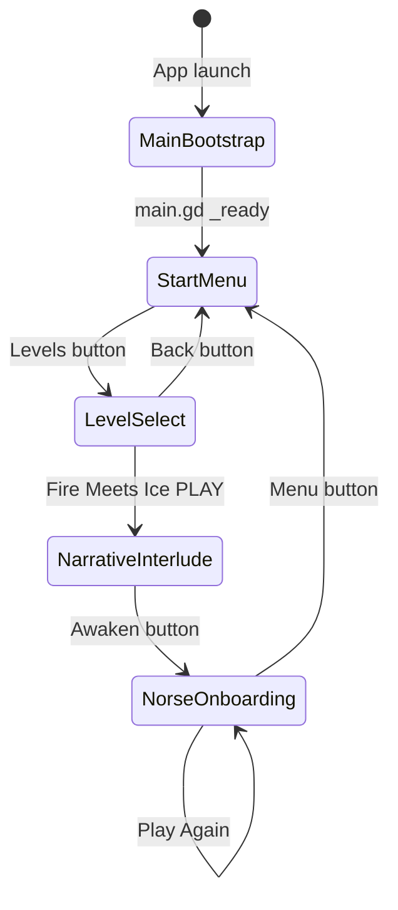

# Playtime — Science Festival Game

**Playtime** is an educational browser game built with **Godot 4.5** that teaches the metaphor of biological signaling cascades. Players guide primordial fire through frozen pathways to warm a dormant creature — mirroring how scientists send signals through biological pathways to activate cells.

| Property | Value |
|----------|-------|
| Engine | Godot 4.5 (GL Compatibility / WebGL 2) |
| Resolution | 1920 × 1080, landscape |
| Export target | HTML5 / WebAssembly |
| Live URL | https://playtime.204.168.183.57.sslip.io/ |
| Repository | `/home/cle1g21/Science-Festival-Game` |

---

## Table of Contents

1. [Repository Layout](#1-repository-layout)
2. [Game State and Screen Flows](#2-game-state-and-screen-flows)
3. [Extended Level Breakdowns](#3-extended-level-breakdowns)
4. [Function Directory](#4-function-directory)
5. [Code Readability Rules](#5-code-readability-rules)
6. [Development Workflow](#6-development-workflow)

---

## 1. Repository Layout

```
Science-Festival-Game/
├── project.godot                 # Godot project configuration
├── export_presets.cfg            # Web export preset (local only, gitignored)
├── deploy.sh                     # Build + deploy to Hetzner VPS
├── README.md                     # This file
│
├── scripts/
│   ├── main.gd                   # Root scene manager and fade transitions
│   ├── setup_godot.sh            # One-time Godot + export template download
│   ├── build.sh                  # Headless import + Web export to build/
│   │
│   ├── start_menu/
│   │   ├── start_menu.gd         # Main menu with Levels button
│   │   └── level_select.gd       # Theme card level selection screen
│   │
│   ├── narrative/
│   │   └── narrative_interlude.gd  # Pre-level Norse story card
│   │
│   ├── levels/
│   │   └── norse_onboarding.gd   # Fire Meets Ice level orchestration
│   │
│   └── core/
│       ├── zone.gd               # Heat zone data class
│       ├── channel.gd            # Inter-zone heat channel data class
│       ├── heat_simulation.gd    # Diffusion engine (dissipation + flow)
│       ├── win_detector.gd     # Win sustain and damage detection
│       ├── input_handler.gd      # Gesture state machine (unused, reserved)
│       ├── thermometer.gd        # HUD thermometer widget
│       ├── hint_system.gd        # Phased ghost-hand tutorial system
│       ├── heart_overlay.gd      # Procedural heart overlay (unused, reserved)
│       └── biomarkers.gd         # Threshold biomarker HUD (unused, reserved)
│
├── scenes/
│   ├── main.tscn                 # App root: scene container + fade overlay
│   ├── start_menu/
│   │   ├── start_menu.tscn       # Main menu background + script
│   │   └── level_select.tscn     # Three-alcove level select background
│   ├── narrative/
│   │   └── narrative_interlude.tscn  # Narrative screen (script builds UI)
│   └── levels/
│       └── norse_onboarding.tscn # Level scene: fire, ice, dragon, boulder
│
├── assets/art/
│   ├── menu/                     # Menu and submenu backgrounds
│   └── norse/                    # Level 1 artwork (background, boulder, heart, thermometer)
│
├── resources/
│   └── heat_gradient.tres        # Color gradient sampled by zone heat
│
├── docs/
│   └── tech-spec-v1-norse-onboarding.md  # Original design specification
│
└── build/                        # Web export output (gitignored)
    ├── index.html
    ├── index.js
    ├── index.wasm
    └── index.pck
```

### Configuration Files

| File | Purpose |
|------|---------|
| `project.godot` | Sets game name **Playtime**, main scene `scenes/main.tscn`, Godot 4.5 features, 1920×1080 viewport, GL Compatibility renderer, touch/mouse emulation |
| `export_presets.cfg` | Defines the **Web** export preset targeting `build/index.html`. Created by `scripts/setup_godot.sh` if missing |
| `.gitignore` | Ignores `.godot/`, `build/`, `export_presets.cfg`, editor caches |

### Shell Scripts

| Script | Purpose |
|--------|---------|
| `scripts/setup_godot.sh` | Downloads Godot 4.5.2 binary and web export templates to `~/.local/share/godot/`. Creates `export_presets.cfg` |
| `scripts/build.sh` | Runs headless Godot import + Web export to `build/` |
| `deploy.sh` | Builds Web export, SCPs to VPS at `root@204.168.183.57:/var/www/playtime`, prints cache-busted live URL |

### Scene Files

| Scene | Attached Script | Description |
|-------|-----------------|-------------|
| `scenes/main.tscn` | `scripts/main.gd` | Root node with `CurrentScene` container and `FadeLayer` overlay |
| `scenes/start_menu/start_menu.tscn` | `scripts/start_menu/start_menu.gd` | Full-screen menu background; buttons built in code |
| `scenes/start_menu/level_select.tscn` | `scripts/start_menu/level_select.gd` | Three-alcove background; theme cards built in code |
| `scenes/narrative/narrative_interlude.tscn` | `scripts/narrative/narrative_interlude.gd` | Empty Control; entire UI built in `_ready()` |
| `scenes/levels/norse_onboarding.tscn` | `scripts/levels/norse_onboarding.gd`, `heat_simulation.gd`, `win_detector.gd` | Level art, fire source, ice zone polygons, dragon, boulder, heart sprite |

### Asset Files

| Path | Used By |
|------|---------|
| `assets/art/menu/Game menu new.png` | Start menu background |
| `assets/art/menu/Menu.jpg` | Alternate menu art |
| `assets/art/menu/Submenu background.png` | Level select background |
| `assets/art/norse/Level 1 bonfire vs dragon background.jpg` | Level background |
| `assets/art/norse/Level 1 bonfire vs dragon new.png` | Dragon creature sprite |
| `assets/art/norse/Boulder 2.png` | Boulder obstacle visual |
| `assets/art/norse/pulsating heart.png` | Heart sprite overlay |
| `assets/art/norse/thermometer_v2.png` | Thermometer HUD texture |

---

## 2. Game State and Screen Flows

### Architecture

There is **no global `GameState` singleton**. Navigation is entirely **signal-driven**:

1. Child scenes emit `scene_requested(scene_path: String)`.
2. `main.gd` receives the signal and calls `transition_to()`.
3. A 0.4-second fade-to-black runs, the child scene is swapped, then fade-in.



### Screen Transition Table

| Current Screen | User Action | Destination Screen | State Reset / Update |
|----------------|-------------|-------------------|----------------------|
| App boot | — (automatic) | `start_menu.tscn` | Fade overlay starts fully opaque; fades in over 0.4s |
| Start Menu | Click **Levels** | `level_select.tscn` | No persistent state changes |
| Start Menu | Click **Multiplayer** or **Settings** | — (no transition) | Buttons are disabled |
| Level Select | Click **< Back** | `start_menu.tscn` | No persistent state changes |
| Level Select | Click **PLAY** on Fire Meets Ice | `narrative_interlude.tscn` | No persistent state changes |
| Level Select | Click Ice Age or Enchanted | — (no transition) | Cards show "Coming Soon"; `unlocked: false` |
| Narrative Interlude | Click **Awaken** | `norse_onboarding.tscn` | All level-local variables initialized fresh in `_ready()` |
| Norse Onboarding | Target heat sustained | Win overlay (same scene) | `_level_has_been_won = true`; simulation frozen; HUD hidden |
| Win Overlay | Click **Play Again** | `norse_onboarding.tscn` (full reload) | Entire level scene reinstantiated; all level state reset |
| Win Overlay | Click **Menu** | `start_menu.tscn` | Level state discarded |

### Level-Local State Variables

The game has **no scores, lives, or persistent progression**. All gameplay state lives inside the active level scene instance.

| Variable | Scope | Type | Purpose | Reset Trigger |
|----------|-------|------|---------|---------------|
| `heat` | `Zone` (per zone) | `float` 0–100 | Current temperature of each heat zone | New level load |
| `_level_has_been_won` | `norse_onboarding.gd` | `bool` | Blocks input after victory | Play Again reload |
| `_damage_tick_count` | `norse_onboarding.gd` | `int` | Counts overheat damage events | New level load |
| `_level_start_time_seconds` | `norse_onboarding.gd` | `float` | Elapsed time since level start (not yet displayed) | New level load |
| `_fire_intensity_multiplier` | `norse_onboarding.gd` | `float` 0.3–2.5 | Pinch/spread or scroll-wheel fire scaling | New level load |
| `_player_is_touching` | `norse_onboarding.gd` | `bool` | Whether primary touch is active | Touch release |
| `_hold_gesture_is_active` | `norse_onboarding.gd` | `bool` | Whether hold threshold has been met | Touch release |
| `_flame_drag_points` | `norse_onboarding.gd` | `PackedVector2Array` | Visual flame trail positions | Touch release / trail fade |
| `_simulation_is_frozen` | `HeatSimulation` | `bool` | Pauses diffusion ticks | `freeze()` on win |
| `_level_has_been_won` | `WinDetector` | `bool` | Stops win monitoring after victory | `reset()` (not called on Play Again — scene reloads) |
| `_player_has_tapped` | `HintSystem` | `bool` | Tutorial: player performed tap | New level load |
| `_player_has_dragged` | `HintSystem` | `bool` | Tutorial: player performed drag | New level load |
| `_player_has_held` | `HintSystem` | `bool` | Tutorial: player performed hold | New level load |
| `_player_has_pinched` | `HintSystem` | `bool` | Tutorial: player performed pinch | New level load |
| `_maximum_heat_reached` | `HintSystem` | `float` | Peak target-zone heat for pinch hint logic | New level load |

---

## 3. Extended Level Breakdowns

### Playable: Fire Meets Ice (Norse Onboarding)

| Property | Detail |
|----------|--------|
| **Internal name** | `norse_onboarding` |
| **Theme** | Norse mythology — Niflheim (ice) meets Muspelheim (fire) |
| **Visual style** | Dark cavern with bonfire vs dragon background, ice zone polygons (hidden), boulder obstacle, brass thermometer HUD, pulsating heart sprite, additive flame trails |
| **Narrative** | Player awakens something dormant beneath the ice by guiding primordial fire |
| **Scene path** | `res://scenes/levels/norse_onboarding.tscn` |
| **Script** | `scripts/levels/norse_onboarding.gd` |

#### Mechanics

| Input | Behavior |
|-------|----------|
| **Tap near fire** | Adds heat to Zone 0 (fire source) within `FIRE_TAP_RADIUS` (180px). Spawns fire burst sparks. Only works near `FIRE_POSITION` (530, 870) |
| **Hold near fire** | After `HOLD_THRESHOLD_SECONDS` (0.4s) without dragging, applies accelerating hold heat to Zone 0 |
| **Drag from fire** | Must start near fire. Draws additive flame trail. Applies drag heat to zones under finger (except zones 5 and 6). Blocked by boulder (`BOULDER_CENTER`, radius 110px) — flames deflect visually, no heat applied. Dragon zone (`DRAGON_CENTER`, radius 280px) allows trail but no direct heat |
| **Pinch / spread** | Two-finger distance change adjusts `_fire_intensity_multiplier` (0.3–2.5), scaling tap/hold/drag heat |
| **Scroll wheel** | Mouse wheel up/down adjusts fire intensity (desktop testing) |
| **Heat diffusion** | Heat flows between connected zones each 0.1s tick. Dissipates at 0.035/tick. Fire source replenishes toward 50. Boulder zone blocks channel flow |
| **Thermometer HUD** | Right-side brass column showing target zone heat with winning band (50–70) and danger zone |
| **Hint system** | Timed ghost-hand tutorials for tap (4s), hold (12s), drag (22s), pinch (30s if heat < 30) |
| **Heart sprite** | Pulses and warms in color as target zone heat rises |

#### Zone Topology

| Zone ID | Role | Conductivity Modifier | Notes |
|---------|------|----------------------|-------|
| 0 | Fire source | 1.0 | `is_source: true`. Replenishes toward 50 |
| 1 | Near fire | 1.2 | Thin ice, warms easily |
| 2 | Junction | 1.0 | Path divergence point |
| 3 | Left path (thick ice) | 0.6 | Slow, safe route |
| 4 | Right path (thin ice) | 1.3 | Fast, risky route |
| 5 | Dragon / target | 1.0 | `is_target: true`. Win monitored here |
| 6 | Boulder obstacle | 0.0 | Blocks channel diffusion. Hit-test obstacle |

#### Channel Connections

| Channel | Zones | Conductivity |
|---------|-------|-------------|
| 0 | 0 → 1 | 0.8 |
| 1 | 1 → 2 | 0.7 |
| 2 | 2 → 3 | 0.5 |
| 3 | 2 → 4 | 0.8 |
| 4 | 3 → 5 | 0.6 |
| 5 | 4 → 5 | 0.7 |

#### Win Condition

| Condition | Value | Source |
|-----------|-------|--------|
| Target heat minimum | 50.0 | `WinDetector.target_heat_min` |
| Target heat maximum | 70.0 | `WinDetector.target_heat_max` |
| Sustain duration | 2.5 seconds | `win_detector.sustain_duration` (overridden in level setup) |
| **Win rule** | Target zone heat must stay within 50–70 for 2.5 consecutive seconds | `WinDetector._process()` |

#### Soft Fail (Damage)

| Condition | Value | Behavior |
|-----------|-------|----------|
| Damage threshold | 85.0 | `WinDetector.damage_threshold` |
| **Damage rule** | Target zone heat ≥ 85 emits `damage_tick` each frame | Shows "Careful -- too much heat!" warning, red flash overlay, increments `_damage_tick_count`. No game over — heat dissipates naturally |

#### Post-Win UI

- Title: **AWAKENED**
- Educational text about biological signaling pathways
- **Play Again** → reloads `norse_onboarding.tscn`
- **Menu** → returns to `start_menu.tscn`

---

### Locked / Planned Levels

| Display Name | Theme | Status | Scene Path |
|-------------|-------|--------|------------|
| Ice Age | Playful / ice age skin | Locked — "Coming Soon" | `""` (empty) |
| Enchanted | Fantasy / enchanted skin | Locked — "Coming Soon" | `""` (empty) |

Defined in `level_select.gd` `themes` array with `unlocked: false`.

---

## 4. Function Directory

Functions are listed alphabetically by file path. Classes marked **(unused)** are registered globally but not instantiated in the current build.

---

### `scripts/core/biomarkers.gd` — class `Biomarkers` **(unused)** | extends `Control`

**Constants:** `MARKERS`, `COL_INACTIVE`, `COL_DANGER`, `DANGER_THRESHOLD` (70.0), `ICON_SIZE` (36.0), `ICON_SPACING` (50.0)

| Function | Description |
|----------|-------------|
| `set_heat(heat_value: float) -> void` | Updates active marker flags and danger state from heat |
| `_process(delta_seconds: float) -> void` | Advances pulse timer and requests redraw |
| `_draw() -> void` | Draws biomarker circles with glow, borders, and danger flash |
| `_ready() -> void` | Creates Unicode icon Label children for each marker |

---

### `scripts/core/channel.gd` — class `Channel` | extends `RefCounted`

**Variables:** `zone_a_id`, `zone_b_id`, `conductivity`, `visual` (Line2D, optional)

| Function | Description |
|----------|-------------|
| `_init(first_zone_identifier, second_zone_identifier, channel_conductivity) -> void` | Constructs a channel between two zone IDs with a conductivity value |

---

### `scripts/core/heart_overlay.gd` — class `HeartOverlay` **(unused)** | extends `Control`

**Constants:** `APPEAR_THRESHOLD` (15.0), `BEAT_THRESHOLD` (30.0), `STRONG_BEAT` (50.0), `DANGER_THRESHOLD` (70.0)

| Function | Description |
|----------|-------------|
| `set_heat(heat_value: float) -> void` | Stores heat driving heart visibility and beat speed |
| `_process(delta_seconds: float) -> void` | Computes BPM-based beat scale multiplier |
| `_draw() -> void` | Draws procedural beating heart shape with glow and danger flash |

---

### `scripts/core/heat_simulation.gd` — class `HeatSimulation` | extends `Node`

**Signals:**
- `heat_updated(zone_states: Array[Dictionary])`
- `zone_threshold_crossed(zone_id: int, heat: float, direction: String)`

**@export variables:** `tick_interval` (0.1), `dissipation_rate` (0.03), `flow_rate` (0.15), `source_replenish_rate` (0.5), `tap_heat` (25.0), `drag_heat` (8.0), `hold_base_heat` (5.0), `hold_accel_rate` (0.8), `hold_cap_multiplier` (10.0), `min_proximity` (0.1)

**Variables:** `fire_position`, `max_fire_distance`, `zones`, `channels`, `obstacle_zone_ids`

| Function | Description |
|----------|-------------|
| `setup(zone_list, channel_list) -> void` | Initializes zones, channels, and threshold brackets |
| `freeze() -> void` | Pauses simulation ticks |
| `unfreeze() -> void` | Resumes simulation ticks |
| `_process(delta_seconds) -> void` | Accumulates tick timer and runs simulation when interval elapses |
| `_simulate_tick() -> void` | Runs dissipation, diffusion, clamping, and threshold crossing detection |
| `_emit_states() -> void` | Emits `heat_updated` with all zone state dictionaries |
| `_get_proximity(world_position) -> float` | Returns proximity factor based on distance from fire |
| `apply_tap(zone_identifier, world_position) -> void` | Adds proximity-scaled tap heat to a zone |
| `apply_drag(zone_identifier, world_position) -> void` | Adds proximity-scaled drag heat to a zone |
| `apply_hold(zone_identifier, world_position, hold_duration_seconds) -> void` | Adds accelerating proximity-scaled hold heat |
| `get_zone_heat(zone_identifier) -> float` | Returns heat of a zone by ID, or 0 |
| `get_target_zone() -> Zone` | Returns the zone marked `is_target` |
| `_get_zone(zone_identifier) -> Zone` | Looks up a zone by ID |
| `_get_bracket(heat_value) -> int` | Maps heat to a threshold bracket index |

---

### `scripts/core/hint_system.gd` — class `HintSystem` | extends `Control`

**Signal:** `hint_shown(hint_id: String)`

| Function | Description |
|----------|-------------|
| `_ready() -> void` | Creates ghost-hand icon and instruction label container |
| `update_max_heat(heat_value) -> void` | Tracks peak heat for pinch hint scheduling |
| `_process(delta_seconds) -> void` | Schedules phased tap/hold/drag/pinch hints by elapsed time |
| `notify_tap() -> void` | Records tap gesture and dismisses tap hint |
| `notify_drag() -> void` | Records drag gesture and dismisses drag hint |
| `notify_hold() -> void` | Records hold gesture and dismisses hold hint |
| `notify_pinch() -> void` | Records pinch gesture and dismisses pinch hint |
| `show_warning(warning_text) -> void` | Shows centered damage warning for 1.5 seconds |
| `show_encouragement(encouragement_text) -> void` | Shows centered encouragement for 2 seconds |
| `_show_ghost_hand(hint_identifier, icon_text, instruction_text, horizontal_ratio, vertical_ratio) -> void` | Positions and fades in a ghost-hand tutorial hint |
| `_show_center_text(hint_identifier, message_text, text_color) -> void` | Shows centered warning or encouragement text |
| `_hide_hint() -> void` | Fades out and hides the current hint |

---

### `scripts/core/input_handler.gd` — class `InputHandler` **(unused)** | extends `Node`

**Signals:** `tap_detected(position, zone_id)`, `hold_started(position, zone_id)`, `hold_tick(position, zone_id)`, `hold_ended(position)`, `drag_started(position)`, `drag_moved(position, zone_id)`, `drag_ended(position)`

**@export variables:** `hold_threshold` (0.4), `drag_threshold` (20.0)

**Enum:** `GestureState { IDLE, TOUCH_DOWN, DRAGGING, HOLDING }`

| Function | Description |
|----------|-------------|
| `_unhandled_input(input_event) -> void` | Routes touch and mouse events to handlers |
| `_process(_delta_seconds) -> void` | Promotes touch-down to hold; emits hold ticks |
| `_handle_touch(touch_event) -> void` | Handles screen touch press and release |
| `_handle_drag(drag_event) -> void` | Handles screen drag movement |
| `_handle_mouse_button(mouse_button_event) -> void` | Handles left mouse button press and release |
| `_handle_mouse_motion(mouse_motion_event) -> void` | Handles mouse motion during active gesture |
| `_check_drag(current_position) -> void` | Detects drag threshold crossing and emits drag events |
| `_release() -> void` | Emits tap, hold_end, or drag_end on release |
| `_detect_zone(screen_position) -> int` | Calls `zone_at_position` callable for hit test |
| `_reset() -> void` | Returns gesture state machine to IDLE |

---

### `scripts/core/thermometer.gd` — class `Thermometer` | extends `Control`

**Constants:** `TARGET_MIN` (50.0), `TARGET_MAX` (70.0), `DANGER_THRESHOLD` (85.0), `DISPLAY_TOP` (0.10), `DISPLAY_BOTTOM` (0.90), `TUBE_LEFT` (0.20), `TUBE_RIGHT` (0.80)

| Function | Description |
|----------|-------------|
| `_ready() -> void` | Loads brass thermometer texture as child TextureRect |
| `set_heat(heat_value) -> void` | Sets target heat for smooth display interpolation |
| `_process(delta_seconds) -> void` | Lerps display heat, updates target/danger flags, redraws |
| `_draw() -> void` | Draws target band, danger zone, and mercury fill with color gradient |

---

### `scripts/core/win_detector.gd` — class `WinDetector` | extends `Node`

**Signals:** `level_won()`, `damage_tick(heat)`, `entered_target_zone()`, `left_target_zone()`

**@export variables:** `target_heat_min` (50.0), `target_heat_max` (70.0), `sustain_duration` (3.0), `damage_threshold` (85.0)

| Function | Description |
|----------|-------------|
| `setup(heat_simulation_node) -> void` | Binds to a HeatSimulation instance |
| `_process(delta_seconds) -> void` | Monitors target heat for win sustain, damage, and zone entry/exit |
| `reset() -> void` | Clears win and sustain tracking state |

---

### `scripts/core/zone.gd` — class `Zone` | extends `RefCounted`

**Variables:** `id`, `heat`, `conductivity_modifier`, `is_source`, `is_target`, `polygon`, `area`

| Function | Description |
|----------|-------------|
| `_init(zone_identifier, conductivity_modifier_value, is_source_zone, is_target_zone) -> void` | Constructs a zone with ID, conductivity, and role flags |
| `add_heat(heat_amount) -> void` | Adds heat clamped to 0–100 |
| `get_normalized_heat() -> float` | Returns heat as a 0–1 fraction |

---

### `scripts/levels/norse_onboarding.gd` | extends `Node2D`

**Signal:** `scene_requested(scene_path: String)`

**Constants:** `MENU_SCENE`, `FIRE_POSITION`, `HOLD_THRESHOLD_SECONDS`, `HEART_BASE_SCALE`, `FIRE_TAP_RADIUS`, `DRAGON_CENTER`, `DRAGON_NO_INPUT_RADIUS`, `BOULDER_CENTER`, `BOULDER_RADIUS`

| Function | Description |
|----------|-------------|
| `_ready() -> void` | Wires scene nodes, creates flame trails, sets up simulation, HUD, and hides zone polygons |
| `_make_trail_line(trail_width, trail_color, draw_order) -> Line2D` | Creates an additive flame trail Line2D |
| `_setup_simulation() -> void` | Creates zones, channels, and configures HeatSimulation |
| `_setup_win_detection() -> void` | Configures WinDetector and connects win/damage/encouragement signals |
| `_setup_hud() -> void` | Instantiates Thermometer and HintSystem on a CanvasLayer |
| `_is_near_fire(world_position) -> bool` | Returns true if position is within fire tap radius |
| `_input(input_event) -> void` | Handles tap, hold, drag, pinch, and scroll-wheel input |
| `_update_flame_trails() -> void` | Updates three layered flame trail Line2D nodes |
| `_handle_pinch_spread() -> void` | Adjusts fire intensity from two-finger distance |
| `_process(delta_seconds) -> void` | Updates hold heat, fire glow, thermometer, heart, and trail fade |
| `_viewport_to_world(screen_position) -> Vector2` | Converts screen coordinates to world coordinates |
| `_zone_at_world_position(world_position) -> int` | Point-in-polygon zone hit test including boulder |
| `_update_heart_sprite(target_heat, delta_seconds) -> void` | Pulses and colors heart sprite based on target heat |
| `_spawn_fire_burst() -> void` | Spawns radiating spark particles from fire on tap |
| `_spawn_deflection(world_position) -> void` | Spawns blue deflection sparks at boulder collision |
| `_on_level_won() -> void` | Freezes simulation, hides HUD/trails, shows win screen |
| `_on_damage_tick(_heat_value) -> void` | Shows damage warning and red flash overlay |
| `_show_win_screen() -> void` | Builds win overlay with narrative text and navigation buttons |
| `_make_win_button(button_text) -> Button` | Creates a styled button for the win screen |

---

### `scripts/main.gd` | extends `Node`

**Constant:** `FADE_DURATION` (0.4)

| Function | Description |
|----------|-------------|
| `_ready() -> void` | Fades in from black and loads start menu |
| `transition_to(scene_path) -> void` | Fade out, swap scene, fade in |
| `_load_scene(scene_path) -> void` | Frees current child, instantiates new scene, connects `scene_requested` |
| `_on_scene_requested(scene_path) -> void` | Forwards child navigation to `transition_to()` |

---

### `scripts/narrative/narrative_interlude.gd` | extends `Control`

**Signal:** `scene_requested(scene_path: String)`

**Constants:** `LEVEL_SCENE`, `NORSE_TITLE`, `NORSE_TEXT`

| Function | Description |
|----------|-------------|
| `_ready() -> void` | Builds centered narrative UI with title, body text, Awaken button, and fade-in |

---

### `scripts/start_menu/level_select.gd` | extends `Control`

**Signal:** `scene_requested(scene_path: String)`

**Constants:** `NARRATIVE_SCENE`, `MENU_SCENE`

**Variables:** `themes` (Array of theme dictionaries)

| Function | Description |
|----------|-------------|
| `_ready() -> void` | Builds back button, title, and three theme cards |
| `_build_card(theme_entry) -> PanelContainer` | Builds unlocked or locked theme card with PLAY or Coming Soon |
| `_make_button(button_text, font_color) -> Button` | Creates a styled navigation button |

---

### `scripts/start_menu/start_menu.gd` | extends `Control`

**Signal:** `scene_requested(scene_path: String)`

**Constant:** `LEVEL_SELECT_SCENE`

| Function | Description |
|----------|-------------|
| `_ready() -> void` | Builds Levels button and disabled Multiplayer/Settings buttons |
| `_make_button(button_text, is_active) -> Button` | Creates active or greyed-out styled button |

---

## 5. Code Readability Rules

All contributors **must** follow these rules when writing or modifying GDScript in this repository.

### Rule 1: No Dense or Cryptic Code

- Do not chain multiple statements on one line with semicolons.
- Do not use single-letter variable names except loop indices, and even then add a comment explaining the index.
- Do not use unexplained magic numbers — extract them to named constants.
- Do not abbreviate words in identifiers (`viewport_size`, not `vp`; `button_node`, not `bt`).

**Non-compliant:**
```gdscript
card.offset_left = -280; card.offset_right = 280
var tw := create_tween()
```

**Compliant:**
```gdscript
# Position the win card horizontally around the screen center.
card.offset_left = -280
card.offset_right = 280
# Animate the overlay fade-in for the win screen.
var win_tween := create_tween()
```

### Rule 2: Fully Spelled-Out Variable Names

Every variable, parameter, and function argument must use complete, descriptive English words.

| Avoid | Use Instead |
|-------|-------------|
| `_won` | `_level_has_been_won` |
| `_hud_layer` | `_heads_up_display_layer` |
| `bt`, `btn` (as sole name) | `button_node` |
| `tw` | `fade_tween` or `win_tween` |
| `vp` | `viewport_size` |
| `mc` | `mercury_color` |
| `sim` | `heat_simulation` |
| `p_id` | `zone_identifier` |

### Rule 3: One Comment Per Executable Line

Place a plain-English comment **directly above every executable statement**. This includes assignments, function calls, control-flow bodies, and return statements.

- File-level `##` doc comments are allowed for class summaries only.
- Per-line comments must not be replaced by block comments.
- Blank lines between logical groups are encouraged.

**Compliant example (from `zone.gd`):**
```gdscript
func add_heat(heat_amount: float) -> void:
	# Increase zone heat and clamp the result between zero and one hundred.
	heat = clampf(heat + heat_amount, 0.0, 100.0)
```

### Rule 4: Block Doc Comments

`##` comments at the top of a file or class may summarize purpose and architecture. They do **not** satisfy Rule 3.

### Rule 5: Consistent Formatting

- Use tabs for indentation (Godot default).
- One statement per line.
- Split long argument lists across multiple lines rather than packing them.
- Name functions with verb phrases (`_setup_simulation`, `_spawn_fire_burst`, `_zone_at_world_position`).

---

## 6. Development Workflow

### Prerequisites (IridisX / headless Linux)

```bash
# One-time setup: downloads Godot 4.5.2 + web export templates
cd /home/cle1g21/Science-Festival-Game
./scripts/setup_godot.sh
```

### Build and Test

```bash
# Build web export locally
./scripts/build.sh

# Build + deploy to live VPS (requires SSH key for root@204.168.183.57)
./deploy.sh
```

After deploy, open the printed URL (with `?v=` cache-buster) in your browser:
`https://playtime.204.168.183.57.sslip.io/`

### Implementation Notes vs Design Spec

The original specification is in [`docs/tech-spec-v1-norse-onboarding.md`](docs/tech-spec-v1-norse-onboarding.md). Key differences in the current build:

| Spec | Implementation |
|------|----------------|
| Skin-card start menu | Levels → Level Select → Narrative flow |
| `InputHandler`-driven gestures | Input handled inline in `norse_onboarding.gd` |
| `HeartOverlay` procedural heart | `HeartSprite` texture with `_update_heart_sprite()` |
| `Biomarkers` HUD | Not used; thermometer + heart sprite instead |
| Win sustain 3.0s | Overridden to 2.5s in level setup |
| Boulder deflection | Added — not in original spec |

---

## License and Credits

Built for the University of Southampton Science Festival. Game engine: [Godot Engine](https://godotengine.org/) (MIT license).
